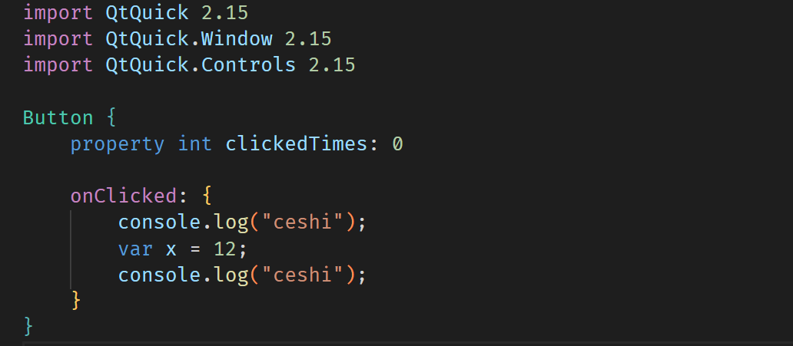

# qmlhelper

**feature**

- qml format by qmlformat
- qml syntax highlight
- qml file icon
- qml lint discard, because qmlls supported lint
- qml debug
- qmldir syntax highlight
- qml autocomplete by qmlls

## TODO

- [ ] QML goto definition.
- [ ] QML hover.
- [ ] Auto find custom QML module.


## QML Format

Use the qmlformat executable file to format qml file.

You need to set the path to the qmlformat file, for example:

```json
"qmlhelper.qmlformat.command": {
    "linux": "/home/vscode/Qt/6.2.3/gcc_64/bin/qmlformat",
    "osx": "/home/vscode/Qt/6.2.3/gcc_64/bin/qmlformat",
    "windows": "C:/Qt/6.5.0/msvc2019_64/bin/qmlformat.exe"
}
```

## QML Debug

> Thanks to orcun-gokbulut's [qml-debug](https://github.com/orcun-gokbulut/qml-debug)!

Right now only attach mode debugging is supported which means you have to launch your application (by hand or through another Visual Studio Code launch configuration) and then attach Qml Debugger.

### Attach Mode

Attach mode attaches Qml Debugger in the already running application instance.

Sample `launch.json` Configuration:
```json
{

    "version": "0.2.0",
    "configurations": [
        {
            "name": "QML Debug: Attach",
            "type": "qml",
            "request": "attach",
            "host": "localhost",
            "port": 12150,
            "paths": {
                "qrc:/qml-debug-test-app/qml": "${workspaceFolder}/qml"
            }
        },
    ]
}
```

**Configuration Properties**

- **name**: Name of your configuration.
- **type**: Type of your debugger extension. This should be qml.
- **request** (Default: attach): Debugger mode. Only attach mode is supported for now. Therefore this should be attach.
- **host** (Default: 127.0.0.1): Hostname/IP Address of the computer that debugee will be run.
- **port** (Default: 12150): Port number of the debugger.
- **paths**: List of Qml paths that will be matched to physical paths for debugger to load correct source code.

### Mapping Virtual paths to Physical Paths

In order to Qml Debuger find your source code, you should have one or more path matching options in your configuration. These mapping tuples are contained in configuration's path property.

**Example**:

```json
"paths": {
    "qrc:/qml-debug-test-app": "${workspaceFolder}/src/qml",
    "qrc:/qml-debug-test-app/ui": "${workspaceFolder}/src/ui/qml"
}
```

### Attach with C++ Debugger

If you want use multiple debugger (C++ and Qml) at the same time you should crate compatable one Qml Debug configuıration and one cppdbg configuration then combine them into launch compound.

You should make sure that cppdbg launch configration launches application with debugging command line arguments with correct hostname and port values that matches with your Qml Debug launch configuration.

**Command Line Arguments**:

```shell
-qmljsdebugger=host:localhost,port:12150,services:DebugMessages,QmlDebugger,V8Debugger
```

**Launch Configuration**:
```json
"host": "localhost",
"port": 12150,
```

**Example compund launch configration**:
```json
{
    "version": "0.2.0",
    "configurations": [
        // C++ Launcher
        {
            "name": "C++ Debug: Launch",
            "type": "cppdbg",
            "request": "launch",
            "program": "${workspaceFolder}/your_qml_application",
            "args": [
                "-qmljsdebugger=host:localhost,port:12150,services:DebugMessages,QmlDebugger,V8Debugger"
            ]
        },
        // Qml Attacher
        {
            "name": "QML Debug: Attach",
            "type": "qml",
            "request": "attach",
            "host": "localhost",
            "port": 12150,
            "paths": {
                "qrc:/qml": "${workspaceFolder}/qml"
            }
        },
    ],
    "compounds": [
        {
          "name": "C++/QML Debug: Launch",
          "configurations": ["C++ Debug: Launch", "QML Debug: Attach"]
        }
    ]
}
```

If you use the CMake extension, you can set the configuration:

```json
{
    "version": "0.2.0",
    "configurations": [
        {
            "name": "C++ Debug",
            "request": "launch",
            "type": "cppdbg",
            "linux": {
                "type": "cppdbg",
            },
            "windows": {
                "type": "cppvsdbg",
            },
            "cwd": "${workspaceFolder}",
            "program": "${command:cmake.launchTargetPath}",
            "args": [
                "-qmljsdebugger=host:localhost,port:12150,block,services:DebugMessages,QmlDebugger,V8Debugger"
            ]
        },
        // Qml Attacher
        {
            "name": "QML Debug",
            "type": "qml",
            "request": "attach",
            "host": "localhost",
            "port": 12150,
            "paths": {
                "qrc:/qml": "${workspaceFolder}/qml"
            }
        },
    ]
}
```

> In our tests, C++ debug needs to start and block before qml debug starts.

## qmlls

Now qt provides the Language Service Protocol (lsp), and in order to be able to use it, you need to set the path to the executable qmlls.

```json
"qmlhelper.qmlls.command": {
    "linux": "/home/vscode/Qt/6.2.3/gcc_64/bin/qmlls",
    "osx": "/home/vscode/Qt/6.2.3/gcc_64/bin/qmlls",
    "windows": "C:/Qt/6.5.0/msvc2019_64/bin/qmlls.exe"
}
```

> In our tests, qmlls is correspondingly slow and does not support jumping to definitions.

In order for qmlls to find a custom qml module, you need to set the search path.

```json
"qmlhelper.qmlls.buildDir": {
    "linux": "./build/linux/debug/bin",
    "windows": "./build/win32/debug/bin"
},
```

## QML Syntax highlight



## QML File Icon


## qmldir highlight


